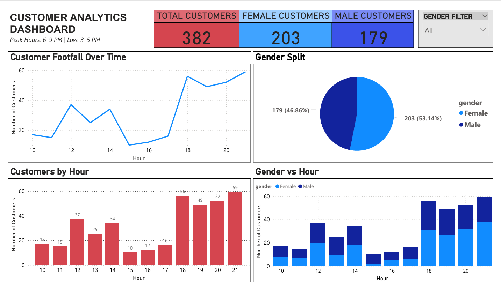

# 🧠 Customer Analytics System

## 📌 Overview

This project is an end-to-end customer analytics system that captures real-time customer data using computer vision, predicts gender using a trained machine learning model, and generates insights through data analysis and visualization.

---

## 🚀 Features

* Real-time face detection using OpenCV
* Gender prediction using FaceNet + SVM (custom trained model)
* Multi-person tracking using Centroid Tracking
* Real-time data logging (CSV storage)
* Simulated dataset generation for analysis
* Exploratory Data Analysis (EDA) using Python
* Interactive dashboard using Power BI

---

## 🛠️ Tech Stack

* Python (OpenCV, NumPy, Pandas)
* Machine Learning (FaceNet, SVM)
* Jupyter Notebook
* Power BI

---

## ⚙️ System Pipeline

Real-time Video → Face Detection → Face Embedding → Gender Prediction → Tracking → Data Storage → EDA → Dashboard

---

## 📊 Key Insights

* Peak customer activity: **6 PM – 9 PM**
* Lowest traffic: **3 PM – 5 PM**
* Female customers slightly outnumber male customers
* Evening hours show the highest engagement

---

📂 Project Structure
Customer-Analytics-System/
│
├── dataset/                      # Training images
├── models/
│   ├── gender_svm.pkl
│   ├── scaler.pkl
│   ├── label_encoder.pkl
│
├── dashboard/
│   ├── PowerBI Dashboard.pbix
│   ├── PowerBI Dashboard.pdf
│   ├── dashboard.png
│
├── centroidtracker.py           # Tracking logic
├── customer_analytics_system.py # Real-time system
├── generate_data.py             # Data generator
├── train_svm.py                 # Model training script
├── eda.ipynb                    # Analysis
│
├── realtime_customers_data.csv  # Real-time collected data
├── simulated_customer_data.csv  # Generated dataset
│
├── haarcascade_frontalface_default.xml   # Face detection model
├── requirements.txt
└── README.md

---

## ▶️ How to Run

### 1️⃣ Install dependencies

```bash
pip install -r requirements.txt
```

### 2️⃣ Run the system

```bash
python customer_analytics_system.py
```

---

## 📌 Output

* Real-time customer dataset (`realtime_customers_data.csv`)
* Simulated dataset (`simulated_customer_data.csv`)
* Analytical insights (EDA)
* Dashboard visualization (Power BI)

---

## 📸 Dashboard Preview



👉 Full interactive dashboard available in `PowerBI Dashboard.pbix`

---

## 🎯 Use Case

This system can be used in:

* Retail stores
* Shopping malls
* Customer behavior analysis
* Footfall analytics

---

## 👩‍💻 Author

Fathima Sameera T M
